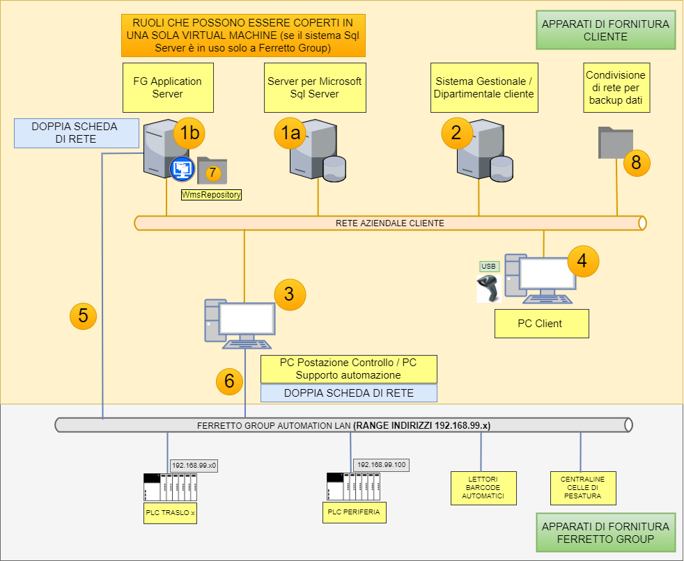

# Introduzione a EjLog

## Cos'è EjLog

EjLog è un software Wms realizzato da Ferretto Group e utilizzato per la gestione dei magazzini automatici.

Il progetto ha avuto la sua origine nel 2008 e si è concretizzato con le prime installazioni nel 2010.

I primi impianti significativi installati sono stati Schoenhuber (IT) e Kobe (NL).

Nello specifico, a inizio 2021, il software è utilizzato per:

* gestione impianti a trasloelevatore (versione trunk 2.4.5.0)
* software di interfaccia per impianti Salvagnini (tag 2.3.12.4 "Salvagnini")
* parte server dei magazzini verticali "New" (dal 2020), dove la parte client è realizzata con il software su Panel PC (tag EjLog  2.3.12.4)

I vertimag EF (pre-2020) erano gestiti dalla versione 2.3.12.2.

## Piattaforma

La piattaforma operativa è:

* linguaggio Java
* sistema operativo Windows
* motore database Microsoft SQL Server

## Architettura sistema

L'architettura generale di un sistema di gestione di un magazzino automatizzato è mostrata qui sotto.

La descrizione breve degli elementi indicati con i numeri è la seguente.

|Elemento | Descrizione |
|:-:|:-|
|1a | E’ il server database del sistema. Il sistema EjLog è basato su Microsoft Sql Server.  |		
|1b| E’ il server dove viene eseguito il software EjLog con i moduli lato “server” attivi (controllore impianto, prenotatore liste, task scheduler, moduli di scambio dati con gestionale)|
|2| Generica indicazione del sistema gestionale o dipartimentale del cliente, con cui EjLog scambia i dati in merito a: unità di carico, articoli, liste di prelievo, movimentazioni avvenute a magazzino. I dati sono scambiati tramite tabelle database di frontiera. |
|3 |PC Postazione di Controllo / supporto automazione: l’esigenza funzionale è quella di avere un PC disponibile per le operazioni di controllo impianto da parte degli addetti del cliente (postazione dalla quale non si interferisce con le operazioni di carico/scarico) e un punto di accesso all’impianto da remoto per i tecnici di automazione PLC Ferretto Group. Se sull’impianto non c’è l’esigenza di una postazione fisica separata da quelle di lavoro, questa macchina può essere una macchina virtuale. |
|4 | Generica indicazione dei PC posizionati a bordo impianto o PC degli uffici su cui è installata una licenza EjLog. I PC a bordo impianto sono in genere dotati di pistola barcode per lo svolgimento delle operazioni manuali di identificazione Udc. |
|5 |Connessione di rete dal server applicativo alla rete automazione: questa connessione è necessaria per permettere al modulo controllore di EjLog di lanciare le missioni ai trasloelevatori e di comandare lo smistamento delle Udc sui convogliatori. Nel quadro elettrico principale dell’impianto sono presenti degli switch industriali Siemens. A uno di questi switch deve arrivare (eventualmente per mezzo di VLAN sugli apparati cliente) la connessione dalla seconda scheda di rete del server. |
|6 | Il PC del punto 3 deve essere dotato di doppia scheda di rete per consentire al software di controllo Siemens (Step 7 / TIA Portal) l’accesso alla rete automazione FG. |
|7|Il PC del punto 1b ospita la cartella WmsRepository che è la cartella dalla quale i vari PC/Server ottengono l’ultima versione rilasciata per l’impianto in oggetto di EjLog. I vari PC creano una copia di backup dei file di configurazione dei singoli PC. La cartella WmsRepository è una delle cartella da sottoporre a regolare procedura di backup da parte del cliente (l’altra cartella è quella del punto successivo) |
|8| Cartella di rete per copia dei file di backup. E’ richiesta la possibilità di accesso in scrittura ad una cartella di rete per riversare la copia dei file di backup del database del magazzino automatico.  |

## Note aggiuntive

* EjLog è un applicativo realizzato in Java, con utilizzo di librerie sviluppate internamente o open source.
* EjLog è una desktop application
* Sul server applicativo il software può essere avviato come servizio.
* L’applicativo viene eseguito tramite una Java Virtual Machine scaricata automaticamente dal WmsRepository (il sistema non risente dell’eventuale aggiornamento di release della Virtual Machine Java installata su Windows).
* Il software utilizza un application launcher (WmsLauncher) realizzato da Ferretto Group su piattaforma .Net. WmsLauncher si occupa di verificare/allineare/aggiornare il programma sui PC Client, scaricando dati dal WmsRepository o da Internet.
