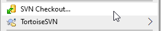
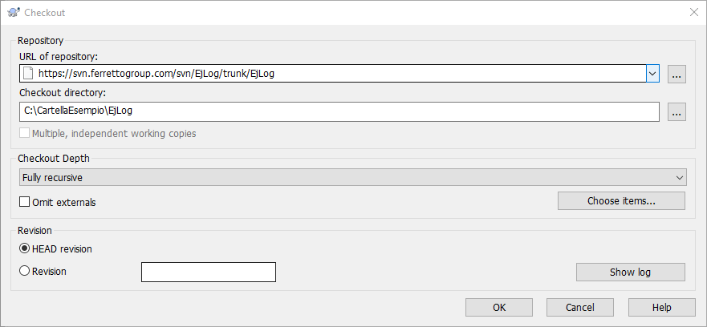
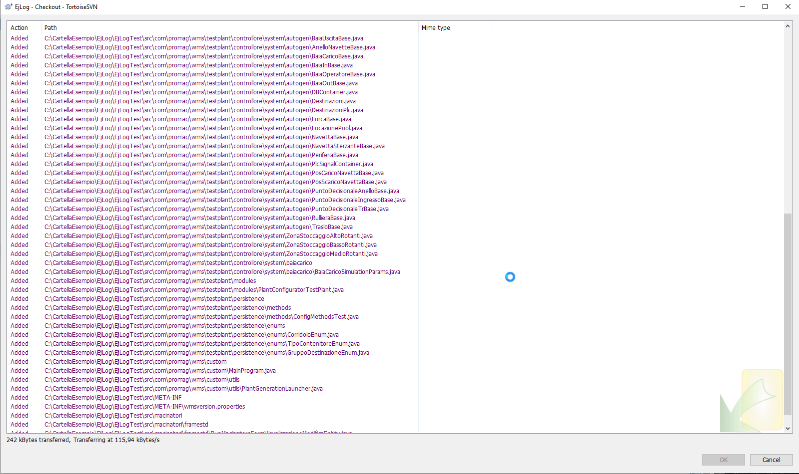

# Checkout Progetto

## Sorgenti

Fino alla versione 2.4.5 del progetto, i sorgenti sono gestiti in formato [Subversion][1] .

I sorgenti del progetto EjLog sono reperibili all'indirizzo  [https://svn.ferrettogroup.com/svn/EjLog][2]

All'indirizzo indicato risponde una installazione di [VisualSvn Server][3], al momento operativa su RE-VM01.

Per la creazione di un account di accesso, rivolgersi ad un amministratore IT.

Il modo utilizzato a standard per il checkout dei sorgenti è tramite [TortoiseSvn][4]

```{warning}
Durante l'installazione del software TortoiseSvn prestare ben attenzione ad installare gli svn binaries, ottenendo la possibilità di operare anche da linea di comando.
```

## Checkout da TortoiseSvn

Creare una nuova cartella, entrarvi e poi eseguire Svn Checkout



Viene visualizzato



Alla richiesta dell'utente VisualSvn inserire le credenziali che poi rimarranno memorizzate nel sistema.



Consultare la documentazione di Subversion/TortoiseSvn per vedere i comandi di utilizzo più frequente (log, commit, update, revert).

## Checkout da command line

il comando da command line è

```
svn checkout https://svn.ferrettogroup.com/svn/EjLog/trunk/EjLog
```

nel caso in cui vengano richieste, inserire le credenziali.

```
svn -?
```
per consultare le altre opzioni disponibili da linea di comando.

  [1]: https://subversion.apache.org/
  [2]: https://svn.ferrettogroup.com/svn/EjLog
  [3]: https://www.visualsvn.com/server/
  [4]: https://tortoisesvn.net/downloads.html
