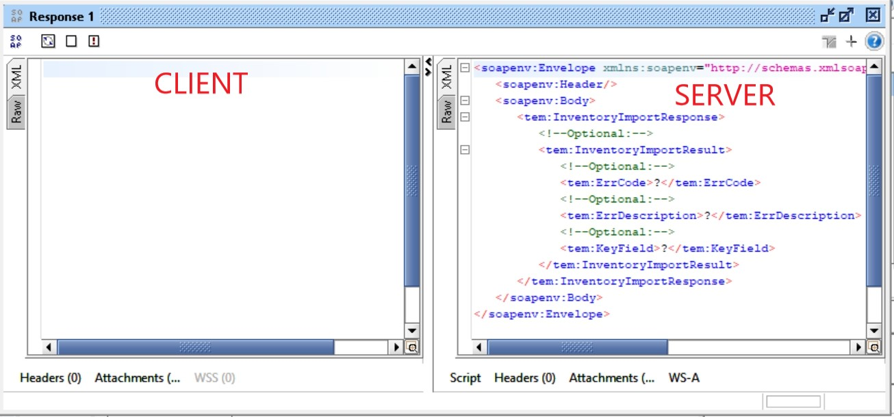

# Web Service

## Introduzione

Per la comunicazione tramite web service si prevede la seguente configurazione:
Il sistema chiamante eseguirà chiamate inviando dati nel formato concordato e, in tempo reale, il sistema ricevente provvederà ad elaborare il set di dati restituendo il risultato al chiamante.

Dovendo implementare uno scambio dati tramite WebService è conveniente arrivare a generere delle classi Java che permettono di utilizzare i servizi in modo più semplice.

Ci sono due famiglie di WebService
* SOAP
* REST

Ci sono scenari in cui EjLog svolge solo la funzione di client (collegandosi ad un WebService (WS) esposto dal cliente) oppure casi in cui svolge il ruolo di server.

## Regole generali di operatività sui dati (WebService)

**Innesco dell’invio dati** Il Chiamante invia i dati in tempo reale ad ogni modifica al proprio dominio dati, nella sequenza cronologica degli eventi che hanno generato la necessità di una trasmissione dati.

**Raggruppamento ed identificazione delle transazioni** Prima di ogni invio dati, il Chiamante genera il codice identificativo della transazione (TransactionId) e uno identificativo della transazione di business (GroupId) e li associa al set dati che verrà inviato.
- **TransactionId** è l’identificativo della transazione dati e raggruppa tutti i record inviati nella medesima trasmissione.
- **GroupId** è l’identificativo della transazione di business e raggruppa tutti i record che appartengono ad un’unica transazione logica di business e che devono essere processati consecutivamente.
- Poiché le chiamate appartenenti allo stesso GroupId possono essere eseguite in tempi differenti, se una delle chiamate incorre in errore, le successive chiamate che contengono dati del medesimo GroupId non saranno eseguite, per evitare inconsistenza nei dati.
- **La ricezione dei record è transazionale** se si verifica un errore, l’intera struttura è rigettata e deve essere nuovamente inviata.
- **Strategia di aggiornamento dati** La strategia è di tipo “Update & Create”. Per ogni record, a parità di chiave, se esistente viene effettuata un’operazione di update altrimenti un’operazione di insert. La cancellazione è di tipo logico e gestita tramite apposito flag di disattivazione del record.
- **La gestione errori è in carico al Chiamante** il rigetto di una chiamata a causa del fallimento di una validazione (es formato data errato), o un problema di connessione di rete, sarà gestito dal chiamante (es. tramite log, interfaccia utente per la gestione e la rielaborazione dati in errore, notifiche, ecc.)
- **Errori di rete** Quando l'errore di transazione è dovuto a un problema di rete, la trasmissione viene ripetuta per 5 volte. In caso di persistenza errori, la trasmissione viene definitivamente contrassegnata come errore e nessun altro tentativo di trasmissione verrà intrapreso.

## SOAP Standard e Sicurezza

- L’interoperabilità tramite web service verrà implementata secondo lo standard SOAP WS-I.
- Nel web service in questione, ogni Metodo sarà protetto da Username e Password di tipo Basic Authentication.
- Il protocollo di comunicazione sarà in http per esigenze di compatibilità con lo standard WS-I.
- I Metodi Esposti possono ricevere, per ogni chiamata, un Segmento dati.
- Ogni segmento può contenere uno o più set di dati, strutturati in Testata e - dove dichiarato nel Metodo – Dettagli.
- Ogni chiamata riceverà al ricevente un messaggio di “Acknowledge” a dichiarazione del risultato della transazione.
NB: Ogni messaggio di Aknowledge non costituisce semplice conferma di ricezione del dato, ma è risposta completa in seguito di:
- Controlli formali
- Controlli di business (coerenza del dato ricevuto con il processo di business a cui il dato è destinato).
- I Metodi esposti sono, quindi, rappresentati con:
- Tabella di Testata: Header
- Tabelle di Dettaglio (se presenti): Details
- Tabella di Risposta: Returns

## SOAP interfaccia dati API

Un servizio SOAP si basa su un file di definizione del servizio (file [wsdl][2]).

Per la macinazione di un web service SOAP a partire da un file .wsdl è necessario:

1. **Creazione file batch wsgen.bat**
2. **Verificare l'interfaccia/e esposta/e dal servizio**
3. **Creazione CLIENT per l'utilizzo del web service**
4. **Definizione del modulo CLIENT nel file wmsModules.xml**
5. **Creazione server di testing locale del Web Service senza l'utilizzo del programma SOAPUI**
6. **Creazione server di testing locale del Web Service con l'utilizzo del programma SOAPUI**
7. **Definizione metodo per invio richieste al web service**

### **Creazione file batch wsgen.bat**

Creare un file **wsgen.bat** e ricopiare il seguente contenuto:
```
rmdir /S /Q E80

   mkdir project_name
   ${JAVA_HOME}\bin\wsimport" -keep -d Epta Epta.wsdl

   del /S *.class
```
Modificare i puntamente della jdk, del nome del progetto e del nome del file.wsdl in base al progetto su cui si sta lavorando.

Al interno della cartella di progetto creare la directory **wsgen** e copiare al suo interno il file **wsgen.bat** creato e il file **.vsdl** ricevuto.

Eseguire il file **wsgen.bat**, si otterrà una struttura analoga alla seguente:


Riportare la cartella di output ottenuta nel progetto custom:


### **Verificare l'interfaccia/e esposta/e dal servizio**

Per verificare qual'è l'interfaccia/e esposta/e dal web service aprire il file **WsiTransferOrderSoap**:


Dal quale si capisce che l'interfaccia esposta si chiama **'InventoryImport'** che ha come parametro di ingresso l'oggetto **ArrayOfLQUAOUTITEM** e ha come oggetto di ritorno **RESULT**.

Un altro modo per verificare le interfaccie esposte è analizzarre direttamente il file .vsdl:

Il metodo da esporre (nel esempio inventoryImport) è visualizzabile anch'esso nel file .vsdl:
```
<wsdl:types>
		<s:schema targetNamespace="http://tempuri.org/"
			elementFormDefault="qualified">
			<s:element name="InventoryImport">
				<s:complexType>
					<s:sequence>
						<s:element name="items" type="tns:ArrayOfLQUA_OUT_ITEM"
							maxOccurs="1" minOccurs="0" />
					</s:sequence>
				</s:complexType>
			</s:element>
			<s:complexType name="ArrayOfLQUA_OUT_ITEM">
				<s:sequence>
					<s:element name="LQUA_OUT_ITEM" type="tns:LQUA_OUT_ITEM"
						maxOccurs="unbounded" minOccurs="0" nillable="true" />
				</s:sequence>
			</s:complexType>
			<s:complexType name="LQUA_OUT_ITEM">
				<s:sequence>
					<s:element name="LENUM" type="s:string" maxOccurs="1"
						minOccurs="0" />
					<s:element name="MATNR" type="s:string" maxOccurs="1"
						minOccurs="0" />
					<s:element name="VERME" type="s:string" maxOccurs="1"
						minOccurs="0" />
					<s:element name="MEINS" type="s:string" maxOccurs="1"
						minOccurs="0" />
					<s:element name="LGNUM" type="s:string" maxOccurs="1"
						minOccurs="0" />
					<s:element name="LETYP" type="s:string" maxOccurs="1"
						minOccurs="0" />
					<s:element name="Lane" type="s:string" maxOccurs="1"
						minOccurs="0" />
					<s:element name="Shelf" type="s:string" maxOccurs="1"
						minOccurs="0" />
					<s:element name="Level" type="s:string" maxOccurs="1"
						minOccurs="0" />
					<s:element name="LGPLA" type="s:string" maxOccurs="1"
						minOccurs="0" />
					<s:element name="WDATU" type="s:string" maxOccurs="1"
						minOccurs="0" />
					<s:element name="SKZUA" type="s:string" maxOccurs="1"
						minOccurs="0" />
					<s:element name="LQNUM" type="s:string" maxOccurs="1"
						minOccurs="0" />
					<s:element name="LGTYP" type="s:string" maxOccurs="1"
						minOccurs="0" />
					<s:element name="Erase" type="s:string" maxOccurs="1"
						minOccurs="0" />
					<s:element name="ZZ_TRANS_LE" type="s:string"
						maxOccurs="1" minOccurs="0" />
					<s:element name="SpecialStock" type="s:string"
						maxOccurs="1" minOccurs="0" />
					<s:element name="Virtual" type="s:string" maxOccurs="1"
						minOccurs="0" />
					<s:element name="MKPF_BWART" type="s:string"
						maxOccurs="1" minOccurs="0" />
					<s:element name="BESTQ" type="s:string" maxOccurs="1"
						minOccurs="0" />
					<s:element name="LGORT" type="s:string" maxOccurs="1"
						minOccurs="0" />
				</s:sequence>
			</s:complexType>
			<s:element name="InventoryImportResponse">
				<s:complexType>
					<s:sequence>
						<s:element name="InventoryImportResult"
							type="tns:RESULT" maxOccurs="1" minOccurs="0" />
					</s:sequence>
				</s:complexType>
			</s:element>
			<s:complexType name="RESULT">
				<s:sequence>
					<s:element name="ErrCode" type="s:string" maxOccurs="1"
						minOccurs="0" />
					<s:element name="ErrDescription" type="s:string"
						maxOccurs="1" minOccurs="0" />
					<s:element name="KeyField" type="s:string" maxOccurs="1"
						minOccurs="0" />
				</s:sequence>
			</s:complexType>
		</s:schema>
	</wsdl:types>
```
### **Creazione CLIENT per l'utilizzo del web service**

Per "chiamare" le funzionalità esposte dal web service, tramite il nostro software, è necessario una classe analoga alla seguente:

```
package com.promag.wms.custom.ws;

import org.springframework.beans.factory.annotation.Autowired;
import org.springframework.context.annotation.AnnotationConfigApplicationContext;
import org.springframework.context.annotation.Bean;
import org.springframework.context.annotation.Configuration;
import org.springframework.context.annotation.PropertySource;
import org.springframework.core.env.Environment;
import org.springframework.remoting.jaxws.JaxWsPortProxyFactoryBean;
import org.tempuri.WsiTransferOrderSoap;

import com.promag.wms.base.system.modules.WmsModule;

@Configuration
@PropertySource(value = "classpath:/config/epta.service.properties")
public class WSClientServiceEpta extends WmsModule {

	@Autowired
	private Environment env;
	private AnnotationConfigApplicationContext context;
	private static WSClientServiceEpta instance;

	@Bean
	protected JaxWsPortProxyFactoryBean service() {
		JaxWsPortProxyFactoryBean s = new JaxWsPortProxyFactoryBean();

		s.setServiceInterface(WsiTransferOrderSoap.class);
		s.setEndpointAddress(env.getProperty("service.endpoint")); //$NON-NLS-1$
		s.setNamespaceUri("http://tempuri.org/"); //$NON-NLS-1$
		s.setPortName("WsiTransferOrderSoap"); //$NON-NLS-1$
		s.setServiceName("WsiTransferOrder"); //$NON-NLS-1$
		s.setWsdlDocumentUrl(WSClientServiceEpta.class.getResource("/config/Epta.wsdl.xml")); //$NON-NLS-1$

		s.setUsername(env.getProperty("service.username")); //$NON-NLS-1$
		s.setPassword(env.getProperty("service.password")); //$NON-NLS-1$

		return s;
	}

	public WsiTransferOrderSoap getEptaService() {
		 return (WsiTransferOrderSoap) context.getBean("service"); //$NON-NLS-1$
	}

	@Override
	public void checkConfiguration() throws Exception {
	}

	@Override
	public void init() throws Exception {
	}

	@Override
	public void start() throws Exception {
		context = new AnnotationConfigApplicationContext(WSClientServiceEpta.class);

		instance = this;
	}

	@Override
	public void stop() throws Exception {
		if (context != null)
			context.close();
	}

	public static WSClientServiceEpta getInstance() {
		return instance;
	}
}

```
Analizzando il codice sorgente della classe notiamo che, la classe, per il corretto funzionamento, ha bisogno di un file di configurazione: **/config/epta.service.properties** il cui contenuto è riportato qui di seguito:
```
#service.endpoint = http://10.28.1.21/AseEPTALGWSAPI/soapws/aseprivate/WsiTransferOrder.asmx?wsdl
service.endpoint = http://PC021811:8088/mock <- testing locale tramite SOAP UI

#Se ci sono username/password associate
service.username = WsFerretto
service.password = Ferrettoi40

```
Il parametro **service.endpoint** è presente nel file .wsdl:
```
<wsdl:service name="WsiTransferOrder">
		<wsdl:port name="WsiTransferOrderSoap"
			binding="tns:WsiTransferOrderSoap">
			<soap:address
				location="http://10.28.1.21/AseEPTALGWSAPI/soapws/aseprivate/WsiTransferOrder.asmx" />
		</wsdl:port>
		<wsdl:port name="WsiTransferOrderSoap12"
			binding="tns:WsiTransferOrderSoap12">
			<soap12:address
				location="http://10.28.1.21/AseEPTALGWSAPI/soapws/aseprivate/WsiTransferOrder.asmx" />
		</wsdl:port>
	</wsdl:service>
```

I parametri:

**s.setPortName("WsiTransferOrderSoap");** <- non quelli della porta 12!
**s.setServiceName("WsiTransferOrder");** <- non quelli della porta 12!
**s.setWsdlDocumentUrl(WSClientServiceEpta.class.getResource("/config/Epta.wsdl.xml"));** <- richiede di copiare il .wsdl ricevuto nel config rinominato

Facoltativi a seconda del WebService i parametri username e password:
**s.setUsername(env.getProperty("service.username"));** //$NON-NLS-1$
**s.setPassword(env.getProperty("service.password"));** //$NON-NLS-1$

**Definizione del modulo CLIENT nel file wmsModulus.xml**

Copiare nel progetto custom il file **wmsModules.xml** ed aggiungere nella sezione relativa ai moduli custom, al fine di instanziare l'utilizzo del modulo client del WS su ogni pc di impianto (o meglio su ogni pc che ha attivato il modulo core), il seguente codice:
```
<bean id="WSServerClient" class="com.promag.wms.custom.ws.WSClientServiceEpta"
		p:group-ref="core"
	/>
```

### **Creazione server di testing locale del Web Service senza l'utilizzo del programma SOAPUI**

Se si vuole effettuare il testing locale del WebService, senza l'utilizzo del programma SOAPUI, è necessario creare una classe analoga alla seguente:

```
package com.promag.wms.custom.ws;

import org.springframework.context.annotation.AnnotationConfigApplicationContext;
import org.springframework.context.annotation.Bean;
import org.springframework.context.annotation.ComponentScan;
import org.springframework.context.annotation.Configuration;
import org.springframework.remoting.jaxws.SimpleJaxWsServiceExporter;

@Configuration
@ComponentScan(basePackageClasses = WSServerMainTestEpta.class)
public class WSServerMainTestEpta {

	@Bean
	protected SimpleJaxWsServiceExporter service() {
		SimpleJaxWsServiceExporter s = new SimpleJaxWsServiceExporter();

		s.setBaseAddress("http://localhost:8089/Service");

		return s;
	}

	public static void main(String[] args) {
		try {
			try (AnnotationConfigApplicationContext c = new AnnotationConfigApplicationContext(WSServerMainTestEpta.class)) {

				Thread.sleep(10000000);
			}

		} catch (Exception e) {
			e.printStackTrace();
		}
	}
}
```
Succenssivamente con i riferimenti al metodo esposto corretto creare la seguente classe:

```
package com.promag.wms.custom.ws;

import javax.jws.WebService;

import org.springframework.stereotype.Component;
import org.tempuri.ArrayOfLQUAOUTITEM;
import org.tempuri.RESULT;
import org.tempuri.WsiTransferOrderSoap;

@Component
@WebService(name = "WsiTransferOrderSoap", targetNamespace = "http://tempuri.org/")
public class WSServerTestEpta implements WsiTransferOrderSoap {

	@Override
	public RESULT inventoryImport(ArrayOfLQUAOUTITEM items) {
		return null;
	}

}
```
Dove il WebService name e il targetNamespace sono specificati nel file .vsdl:
```
@WebService(name = "WsiTransferOrderSoap", targetNamespace = "http://tempuri.org/")
```
```
<wsdl:service name="WsiTransferOrder">
```
```
targetNamespace="http://tempuri.org/"
```
L'oggetto RESULT di ritorno sarà l'oggetto di risposta del web service.

### **Creazione server di testing locale del Web Service con l'utilizzo del programma SOAPUI**

Per il testing del web service risulta utile l'utilizzo del programma [SOAPUI][1].
Avviare il programma e creare un nuovo progetto SOAP:


Premere tasto dx su WsiTransferOrderSoap per generare l'oggetto Mock WebService:


Verrà aperta la seguente schermata, premere OK:


Premere ancora OK:


A questo punto è possibile lanciare in esecuzione il WebService SOAP.
Doppio click su **WsiTransferOrderSoap MockService** e premere l'icona di avvio:


A questo punto è possibile simulare lo scambio di informazioni tra client e server; doppio click sul metodo **InventoryImport** -> doppio click su **Response 1** :



Nella schermata **"SERVER"** è possibile modificare il messaggio di risposta dal Server.
Nella scheramta **"CLIENT"** è possibile visualizzare la richiesta inviata dal client.

Esempio messaggio inviato dal client:

```
<?xml version="1.0" encoding="UTF-8"?>
<S:Envelope xmlns:S="http://schemas.xmlsoap.org/soap/envelope/">
   <S:Body>
      <InventoryImport xmlns="http://tempuri.org/">
         <items>
            <LQUA_OUT_ITEM>
               <LENUM>1</LENUM>
               <MATNR>1</MATNR>
               <VERME>1</VERME>
               <MEINS>1</MEINS>
               <LGPLA>1</LGPLA>
               <WDATU />
               <SKZUA />
               <LGTYP />
               <Erase />
               <ZZ_TRANS_LE />
               <SpecialStock />
            </LQUA_OUT_ITEM>
         </items>
      </InventoryImport>
   </S:Body>
</S:Envelope>
```
### Definizione metodo per invio richieste al web service

Per inviare la richiesta al web service da EjLog a questo punto è sufficiente:

```
public static RESULT sendPrelievoDaFerrettoToWebService(ArrayOfLQUAOUTITEM items) {

		WsiTransferOrderSoap service = WSClientServiceEpta.getInstance().getEptaService();

		((BindingProvider) service).getRequestContext().put(BindingProviderProperties.CONNECT_TIMEOUT, 5000);
        ((BindingProvider) service).getRequestContext().put(BindingProviderProperties.REQUEST_TIMEOUT, 8000);

		RESULT result = service.inventoryImport(items);

		return result;
	}
```
E' quindi possibile elaborare il messaggio di risposta ricevuto dal web service nel oggetto result.


[1]: https://www.soapui.org/downloads/soapui/
[2]: https://it.wikipedia.org/wiki/Web_Services_Description_Language
