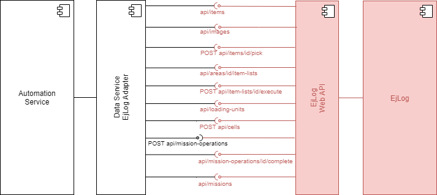
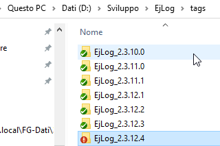
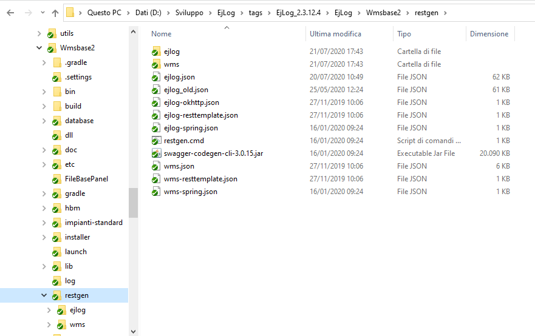
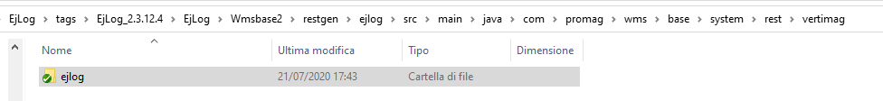
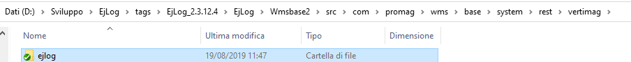
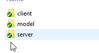
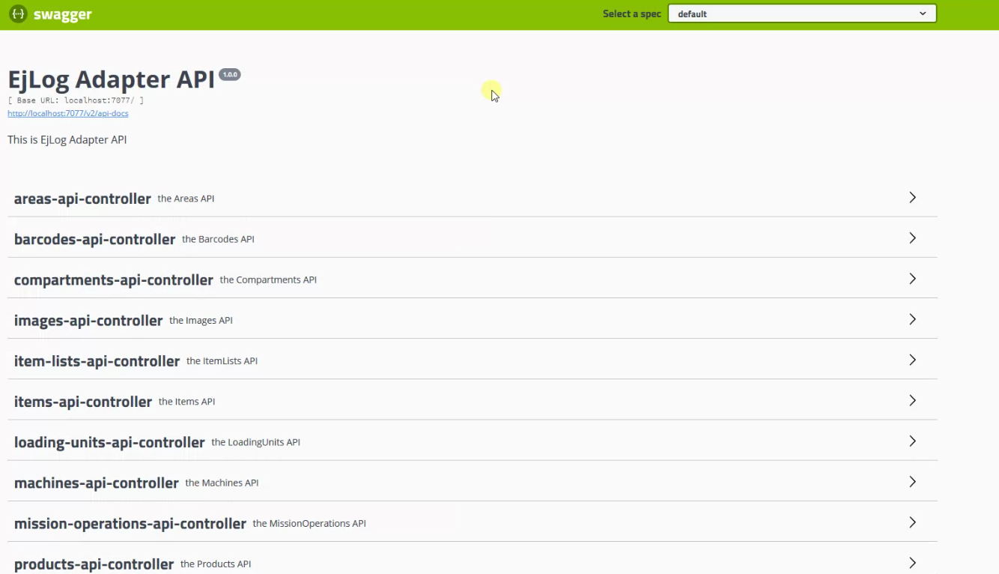
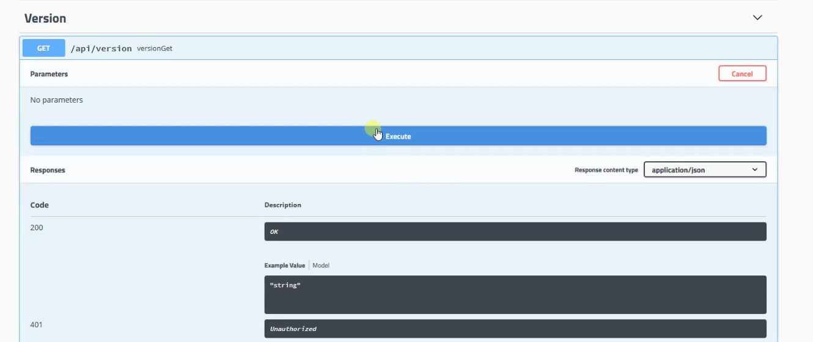
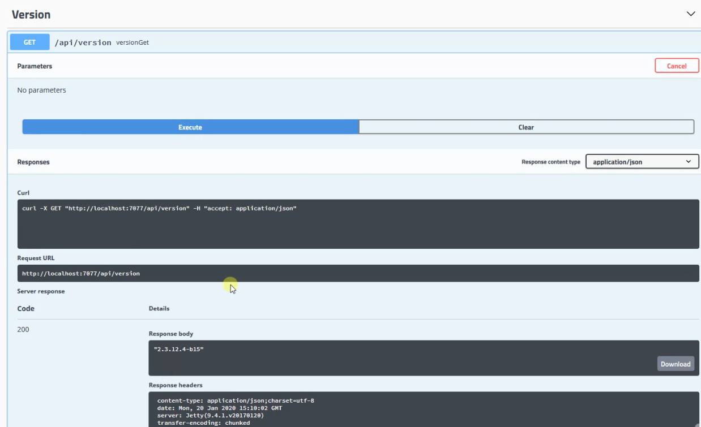

# WMS Adapter

Questo capitolo ha lo scopo di descrivere come fare ad aggiungere/modificare/eiminare servizi sull'adapter che è stato creato tra l'EjLog e il PPC del nuovo Vertimag.

## Infrastruttura

Al momento nei nuovi Vertimag è stato implementato un nuovo sw a bordo macchina, chiamato PPC (Panel PC), sviluppato in C#. Questo ha preso il posto del plc del vecchio modello e gestisce tutte le movimentazioni della macchina, oltre al discorso sensoristica e allarmi.

Il vero e proprio wms del sistema è, al momento, rimasto l'EjLog.

E' stata quindi sviluppata una interfaccia fra la nuova applicazione che gestisce la macchina Vertimag ed il sistema di gestione EjLog attualmente utilizzato. Tutti i servizi al momento attivi sono tutti esposti lato EjLog (solo server).

Questo di seguito è lo schema ad alto livello dei sotto-sistemi coinvolti.



I due sistemi comunicano tramite web service di tipo REST.

E' stato adottato [Swagger][1], che permette di gestire in modo migliore le API.

I colleghi che sviluppano il sw PPC aggiornano il file relativo ai contratti in formato swagger e lo inviano a noi. Questo deve poi essere processato lato EjLog per andare ad implementare le nuove modifiche. Vediamo di seguito i passi per poter implementare le modifiche su EjLog.


## Versione EjLog

Il sw **EjLog** che gira sui nuovi verticali è la versione **2.3.12.4**, che è possibile trovare tra i tags di EjLog.



## File dei contratti

Il file che viene generato da Swagger e che ci viene poi girato dai colleghi è in formato json.

Nella cartella Wmsbase2 del progetto c'è la directory restgen. Copiare qui il file dei contratti in json con il nome **ejlog.json**.



All'interno di questa cartella c'è il file **restgen.cmd**, che è il batch da lanciare per far partire il reverse engineer del file json.
A partire dal json vengono create le classi java all'interno della cartella ejlog, che rappresentano le funzioni e le chiamate del servizio REST.

Lo step successivo è quello di lanciare un merge tra le nuovi classi create e quelle esistenti con attenzione, in maniera tale da avere sott'occhio le modifiche che sono state apportate all'interfaccia.

```{warning}
Non lanciare un override secco di tutte le classi.
Ad esempio nei controller ci sono tutte le logiche precedentemente implementate che andrebbero perse.

ImagesApi è l'unica interfaccia che è stata modificata a mano e quindi non bisogna toccare.
```
Il merge da lanciare è tra le classi autogenerate:


e quelle attuali del sw:



All'interno della cartella ejlog appena creata ci sono 3 directory: client, model e server.



### Client ####

Qui ci sono le classi per invocare quel servizio, nel caso in cui il servizio dovesse essere pubblicato.

### Model ####

Qui sono contenute le classi che rappresentano le entity utilizzate per lo scambio dati tra i due sistemi.

### Server ####

Qui ci sono le classi che servono per gestire le chiamate ricevute ai servizi esposti. Per ogni servizio c'è un file di interfaccia (ad es. *AreaApi*) e una di controller (ad es. *AreaApiController*). E' proprio in quest'ultima classe che viene aggiunta la logica.


Le parti principali da mergiare sono model e server che sono quelle effettivamente utilizzate.

Quando si aggiunge un nuovo metodo oppure variano le annotation, bisogna riportare le modifiche dall'interfaccia al controller manualmente, altrimenti non funziona.

## Interfaccia grafica per test ##

Lanciando il sw EjLog è possibile accedere all'interfaccia grafica che swagger mette a disposizione per poter testare in maniera agevole i servizi esposti dal proprio web service. L'indirizzo è http://localhost:7077/swagger-ui.html.



Ad esempio, se volessimo provare il servizio esposto da EjLog che restituisce la versione corrente del sw, bisogna accedere alla voce Version, individuare il metodo di interesse (*versionGet*) e cliccare sul pulsante Execute.



Così facendo viene invocato il metodo richiesto sul nostro sw.
Sotto vediamo la risposta che restituisce EjLog.




[1]: https://swagger.io/
